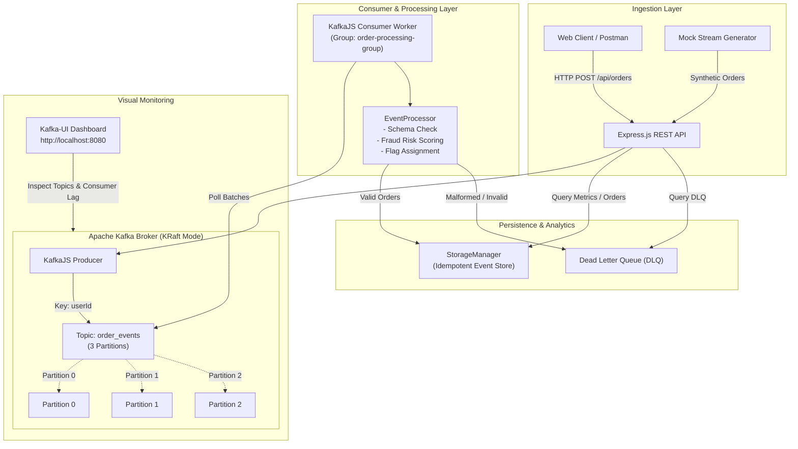

# 🚀 Real-Time Kafka Event Pipeline & Fraud Detection Engine

A production-grade, distributed event-driven data pipeline built with **Node.js**, **Express.js**, **Apache Kafka**, and **KafkaJS**. This system simulates real-time financial and e-commerce transactions, enforces partition-level chronological ordering, applies automated risk evaluation and fraud detection, isolates invalid payloads via a Dead Letter Queue (DLQ), and persists structured events for analytical querying.

[](https://github.com/ManuStu-web/Real-Time-Kafka-Event-Pipeline-Fraud-Detection-Engine/actions)

-red.svg)


---

## 📑 Table of Contents
1. [Project Overview](#-project-overview)
2. [Technology Stack](#-technology-stack)
3. [System Architecture](#-system-architecture)
4. [Distributed Systems & Kafka Core Concepts](#-distributed-systems--kafka-core-concepts)
5. [Directory Structure](#-directory-structure)
6. [Quick Start & How to Run](#-quick-start--how-to-run)
   - [Mode 1: Instant Local Demonstration (Zero Docker Needed)](#mode-1-instant-local-demonstration-zero-docker-needed)
   - [Mode 2: Full Docker + Kafka KRaft + Kafka-UI](#mode-2-full-docker--kafka-kraft--kafka-ui)
7. [REST API & Postman Testing](#-rest-api--postman-testing)
8. [Automated Testing & Blocking Failing Pushes](#-automated-testing--blocking-failing-pushes)
9. [CI/CD with GitHub Actions](#-cicd-with-github-actions)

---

## 🎯 Project Overview

In high-throughput e-commerce and financial platforms, synchronous HTTP calls between microservices create bottlenecks, tight coupling, and cascading failures. This project demonstrates an **event-driven architecture** using **Apache Kafka** to decouple transaction ingestion from downstream processing.

### Key Capabilities:
- **Event Producer**: Generates or ingests order events via HTTP and streams them to the Kafka `order_events` topic.
- **Key-Based Partitioning**: Messages are keyed by `userId`, guaranteeing strict FIFO ordering per customer across distributed partitions.
- **Consumer Stream Processor**: Operates in consumer group `order-processing-group`, continuously polling messages, calculating risk scores, and categorizing orders as `VERIFIED`, `REQUIRES_REVIEW`, or `FLAGGED_HIGH_VALUE`.
- **Dead Letter Queue (DLQ)**: Malformed or unparseable messages are safely diverted to an isolated DLQ topic/store without halting consumer progress.
- **Idempotent Storage & Analytics**: Events are saved to a deduplicated persistent store, exposing real-time metrics (volume, fraud alerts, average order value).

---

## 🛠 Technology Stack

| Layer | Technology | Purpose |
| :--- | :--- | :--- |
| **Language** | JavaScript (Node.js 20+ / 22+) | High-throughput asynchronous event processing |
| **Backend API** | Node.js + Express.js | Ingestion endpoints, metrics reporting, health checks |
| **Messaging** | Apache Kafka (KRaft mode) | Distributed streaming platform with zero ZooKeeper dependency |
| **Kafka Client** | KafkaJS (`kafkajs`) | Native JavaScript Kafka client supporting producers and consumer groups |
| **Containerization** | Docker + Docker Compose | Containerized orchestration of Kafka broker, Kafka-UI, API, and consumer worker |
| **Testing** | Jest + Supertest | Unit, schema, integration, and REST API test suites (18 tests) |
| **CI/CD** | GitHub Actions | Automated build, test, and push validation pipeline |
| **API Testing** | Postman | Pre-configured collection & environment JSON for API validation |
| **Version Control** | Git + GitHub | Branch protection, Git pre-push hook test enforcement |

---

## 🏗 System Architecture



### Flow Walkthrough:
1. **Producer Publishing**: A client submits an order or the stream generator fires. The `OrderProducer` attaches `userId` as the partition key. Kafka hashes the key so that all transactions for `userId: "user_101"` are delivered to the exact same partition in chronological order.
2. **Consumer Polling**: The `OrderConsumer` pulls records from Kafka.
3. **Validation & Business Logic**:
   - Total amount $\ge \$1,000 \rightarrow$ Risk $+0.65$ (`AMOUNT_EXCEEDS_THRESHOLD`)
   - Category = `Luxury` $\rightarrow$ Risk $+0.20$ (`HIGH_RISK_CATEGORY_LUXURY`)
   - Quantity $\ge 3 \rightarrow$ Risk $+0.15$ (`BULK_QUANTITY_PURCHASE`)
   - $\text{Risk} \ge 0.60 \rightarrow$ Status `FLAGGED_HIGH_VALUE`
   - $\text{Risk} < 0.30 \rightarrow$ Status `VERIFIED`
4. **Resilience (DLQ)**: If a message has corrupted JSON or missing mandatory fields, it is captured in the DLQ instead of throwing an unhandled exception and crashing the consumer.
5. **Idempotence**: Every record is keyed by `orderId`. Re-consuming a message will update rather than duplicate data.

---

## 🧠 Distributed Systems & Kafka Core Concepts

Understanding these four concepts is crucial for interviews and classroom presentations:

### 1. Key-Based Partitioning & Ordering Guarantees
- Kafka guarantees total order **within a single partition**, but **not across multiple partitions**.
- By using `key = userId`, Kafka hashes the user ID using Murmur2 to determine the partition:
  $$\text{Partition} = |\text{hash}(\text{userId})| \pmod{\text{numPartitions}}$$
- **Why this matters**: A single user's orders will never be processed out-of-order, preventing race conditions (e.g. processing an order cancellation before its creation).

### 2. Consumer Groups & Horizontal Scalability
- Consumers with the same `groupId` (`order-processing-group`) share the load of topic partitions.
- If a topic has 3 partitions:
  - 1 Consumer $\rightarrow$ reads all 3 partitions.
  - 3 Consumers $\rightarrow$ each reads exactly 1 partition concurrently.
  - 4 Consumers $\rightarrow$ 1 consumer sits idle as a hot standby.

### 3. Delivery Semantics & Offset Commits
- This pipeline implements **At-Least-Once Delivery**:
  - The consumer processes the message and persists it to storage *before* committing its offset back to Kafka.
  - If the consumer crashes mid-processing, the replacement consumer re-reads the uncommitted offset.
  - To prevent duplicate entries upon re-delivery, our storage layer uses **idempotent writes** indexed by `orderId`.

### 4. Dead Letter Queue (DLQ) Pattern
- A "poison pill" message (e.g. malformed JSON or binary garbage) would otherwise cause the consumer to fail indefinitely in a crash-loop.
- The DLQ pattern intercepts invalid payloads, logs the diagnostic error, commits the offset, and isolates the bad message into `order_dlq` for offline inspection.

---

## 📁 Directory Structure

```text
CCProject/
├── .github/
│   └── workflows/
│       └── ci.yml               # GitHub Actions CI/CD workflow
├── .githooks/
│   └── pre-push                 # Git pre-push hook to block failing tests
├── postman/
│   ├── Kafka_Event_Pipeline.postman_collection.json  # 8 Pre-configured API tests
│   └── Kafka_Event_Pipeline.postman_environment.json # Postman Environment (baseUrl)
├── src/
│   ├── config.js                # Centralized configuration & environment loader
│   ├── kafkaClient.js           # KafkaJS client + in-memory simulation engine
│   ├── producer.js              # KafkaJS Producer with partition key routing
│   ├── consumer.js              # KafkaJS Consumer with fraud rules & DLQ
│   ├── processor.js             # Business logic & risk evaluation engine
│   ├── storage.js               # Idempotent storage manager & real-time metrics
│   ├── app.js                   # Express.js REST API application
│   ├── server.js                # HTTP server bootstrap entry point
│   └── demoRunner.js            # Live interactive demo script with terminal dashboard
├── tests/
│   ├── validation.test.js       # TC 1-4: Order validation & schema rules
│   ├── processor.test.js        # TC 5-8: Fraud scoring & risk classifications
│   ├── producer.test.js         # TC 9-11: Event generation & partition keys
│   ├── dlq.test.js              # TC 12-13: DLQ poison-pill isolation
│   ├── api.test.js              # TC 14-17: Express REST API endpoints
│   └── pipeline.e2e.test.js     # TC 18: Full end-to-end stream integration
├── scripts/
│   └── setupHooks.js            # Git hook registration script
├── Dockerfile                   # Production container definition
├── docker-compose.yml           # Kafka KRaft + Kafka-UI + API + Consumer stack
├── .env.example                 # Template environment variables
├── package.json                 # Node dependencies & npm scripts
└── README.md                    # Project documentation
```

---

## 🚀 Quick Start & How to Run

### Mode 1: Instant Local Demonstration (Zero Docker Needed)
This mode runs the entire pipeline locally using our built-in Kafka simulation mode. Perfect for running immediately without installing Docker!

```bash
# 1. Install dependencies
npm install

# 2. Run the full test suite (18 tests)
npm test

# 3. Run the interactive live demo with ASCII analytics dashboard
npm run pipeline:demo

# 4. Start the Express REST API
npm start
```
The API is now running at `http://localhost:3000`.

---

### Mode 2: Full Docker + Kafka KRaft + Kafka-UI
To run on a real distributed Apache Kafka cluster with a visual web UI:

```bash
# 1. Start all containers in background
docker compose up -d --build

# 2. View running containers
docker compose ps
```

Services exposed:
- **Express API & Producer**: [http://localhost:3000](http://localhost:3000)
- **Kafka-UI Management Console**: [http://localhost:8080](http://localhost:8080)
- **Apache Kafka Broker**: `localhost:9092`

To shut down:
```bash
docker compose down
```

---

## 📬 REST API & Postman Testing

### Endpoints:
| Method | Endpoint | Description |
| :--- | :--- | :--- |
| `GET` | `/health` | Service health status and uptime |
| `POST` | `/api/orders` | Ingest single order and publish to Kafka |
| `POST` | `/api/orders/generate` | Trigger automated stream of $N$ orders |
| `GET` | `/api/orders` | Retrieve list of processed orders |
| `GET` | `/api/orders/:id` | Retrieve specific order by ID |
| `GET` | `/api/metrics` | Retrieve live transaction volume and fraud stats |
| `GET` | `/api/dlq` | Retrieve Dead Letter Queue entries |

### Postman Setup:
1. Open **Postman**.
2. Click **Import** $\rightarrow$ Select `postman/Kafka_Event_Pipeline.postman_collection.json` and `postman/Kafka_Event_Pipeline.postman_environment.json`.
3. Select the **Kafka Pipeline Local** environment.
4. Execute the requests in sequence:
   - `1. Health Check` $\rightarrow$ verifies server is live.
   - `2. Ingest Normal Order` $\rightarrow$ triggers a verified transaction.
   - `3. Ingest High-Value Fraud Alert Order` $\rightarrow$ triggers a flagged transaction ($>\$1,000$).
   - `4. Ingest Malformed Order` $\rightarrow$ routes message to the DLQ.
   - `5. Trigger Batch Generation Stream` $\rightarrow$ generates 10 simulated orders in real-time.
   - `6. Query Real-Time Pipeline Metrics` $\rightarrow$ inspect aggregated analytics.

---

## 🧪 Automated Testing & Blocking Failing Pushes

The project comes with **18 automated tests** across **6 suites**, exceeding the 4-test requirement:

```bash
npm run test:coverage
```

### Blocking Failing Pushes Locally:
To ensure code cannot be pushed if tests fail, run:
```bash
node scripts/setupHooks.js
```
This configures a **Git pre-push hook** (`.githooks/pre-push`). If any test fails, your terminal output will display:
```text
========================================================
 [Git Pre-Push Hook] Running Jest Test Suite...
========================================================
...
========================================================
 [ERROR] Git push BLOCKED!
 One or more Jest tests failed. Fix failing tests first.
========================================================
```

---

## ⚙️ CI/CD with GitHub Actions

The repository includes a production CI/CD workflow at `.github/workflows/ci.yml`. On every `git push` or `pull_request` to `main`:
1. Checks out code on an `ubuntu-latest` runner.
2. Installs Node.js and packages with `npm ci`.
3. Runs the Jest test suite with coverage (`npm run test:coverage`).
4. Executes an end-to-end dry run (`node src/demoRunner.js`).
5. **Blocks merging/pushing** if any test fails.
